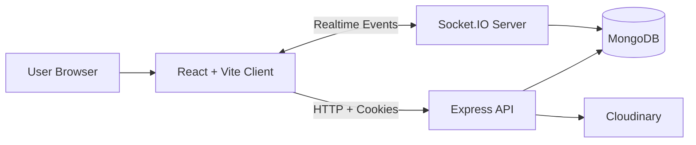

# NexChat

NexChat is a full-stack real-time chat application built with React, Vite, Node.js, Express, MongoDB, and Socket.IO.

## Features

- Real-time messaging
- Cookie-based authentication
- Recovery-code password reset with no email dependency
- Profile management with image upload
- Online user presence
- Responsive UI

## Tech Stack

Frontend:
- React
- Vite
- Socket.IO client
- React Router
- React Hot Toast

Backend:
- Node.js
- Express
- MongoDB and Mongoose
- Socket.IO
- Cloudinary
- JWT

## Project Structure

```
chat-app/
├── client/
└── server/
```

## Architecture



### Request/Realtime Flow

1. User authenticates from client, backend sets JWT cookie.
2. Client calls protected REST APIs with cookie credentials.
3. Client opens Socket.IO connection with current user id.
4. Server maps user id to socket id and emits online presence/events.
5. Messages are persisted in MongoDB and broadcast in realtime when receiver is online.

## Local Setup

### Backend

```bash
cd server
npm install
npm start
```

Required backend env vars:

```env
MONGODB_URI=
JWT_SECRET=
CLOUDINARY_CLOUD_NAME=
CLOUDINARY_API_KEY=
CLOUDINARY_API_SECRET=
CORS_ORIGINS=*
RECOVERY_CODE_PEPPER=change-this-in-production
```

### Frontend

```bash
cd client
npm install
npm run dev
```

Required frontend env vars:

```env
VITE_BACKEND_URL=http://localhost:5001
```

## Auth Flow

- Users sign up with email, password, name, and bio.
- The server generates a recovery code once at signup.
- The recovery code is shown once to the user.
- Password reset uses email + recovery code + new password.
- Logged-in users can generate a new recovery code from their profile page.

## API Overview

Base URL:

- Local backend: `http://localhost:5001`

Auth routes (`/api/auth`):

- `POST /signup` - Register user and return one-time recovery code
- `POST /login` - Login and set auth cookie
- `POST /logout` - Clear auth cookie
- `GET /check` - Validate current session (protected)
- `PUT /update-profile` - Update name/bio/profile picture (protected)
- `PUT /skills-profile` - Update skills and collaboration profile (protected)
- `GET /discover` - Discover collaborators by filter (protected)
- `POST /recovery-code` - Generate a new recovery code (protected)
- `POST /reset-password` - Reset password using email + recovery code

Message routes (`/api/messages`):

- `GET /users` - Sidebar users + unseen message counts (protected)
- `GET /:id` - Conversation with selected user (protected)
- `POST /send/:id` - Send text/image message to selected user (protected)
- `PUT /mark/:id` - Mark message as seen (protected)
- `DELETE /:id` - Delete own message (protected)

Status route:

- `GET /api/status` - Health check endpoint

Realtime socket events:

- Server -> Client: `getOnlineUsers`, `newMessage`, `messageSeen`, `messageDeleted`

## Deployment

Recommended deployment split:

1. Deploy the backend to Render or another persistent Node host.
2. Deploy the frontend to Vercel.
3. Set `VITE_BACKEND_URL` on the frontend.
4. Set `CORS_ORIGINS` on the backend to include your frontend URL.
5. Add your production MongoDB, Cloudinary, JWT, and recovery-code secrets.

This project is not a single Vercel-only app because the backend uses a live server and Socket.IO.

## Notes

- OTP/email password reset was removed.
- Recovery codes are the zero-cost reset mechanism.
- The old code becomes invalid after generating a new recovery code or resetting the password.

## License

This project is licensed under the MIT License.

## Contact
M Vinith Krishna - vinithkrishna20@gmail.com
